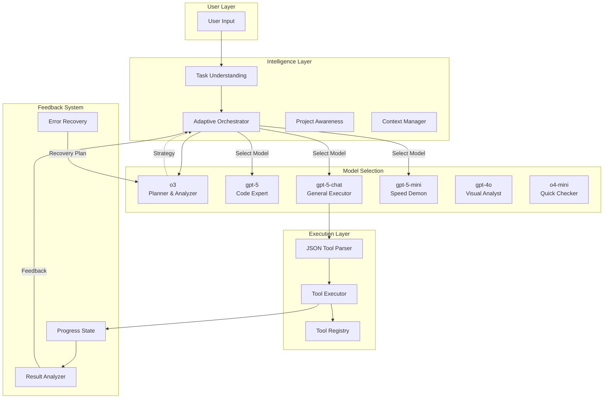
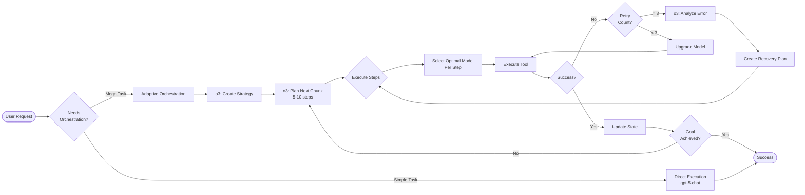
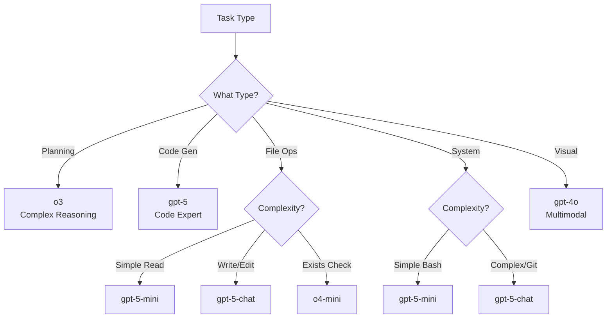
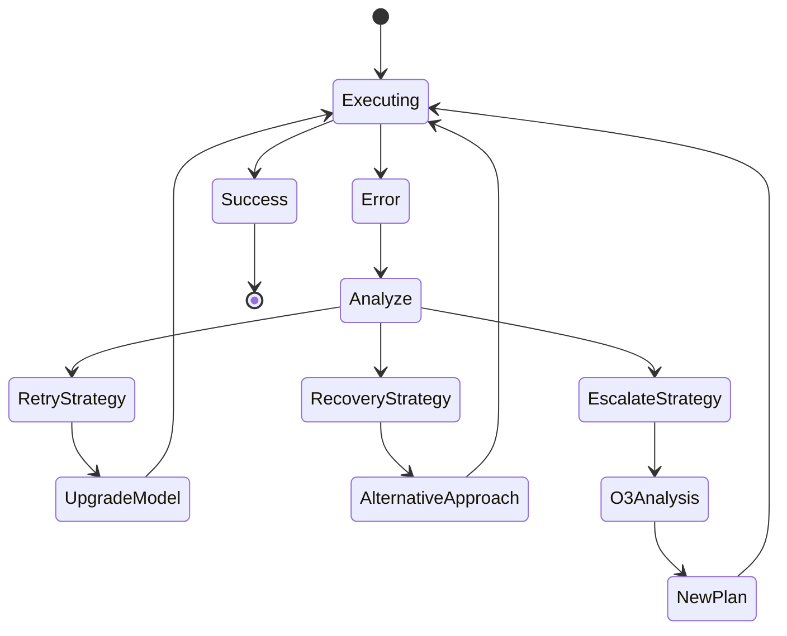
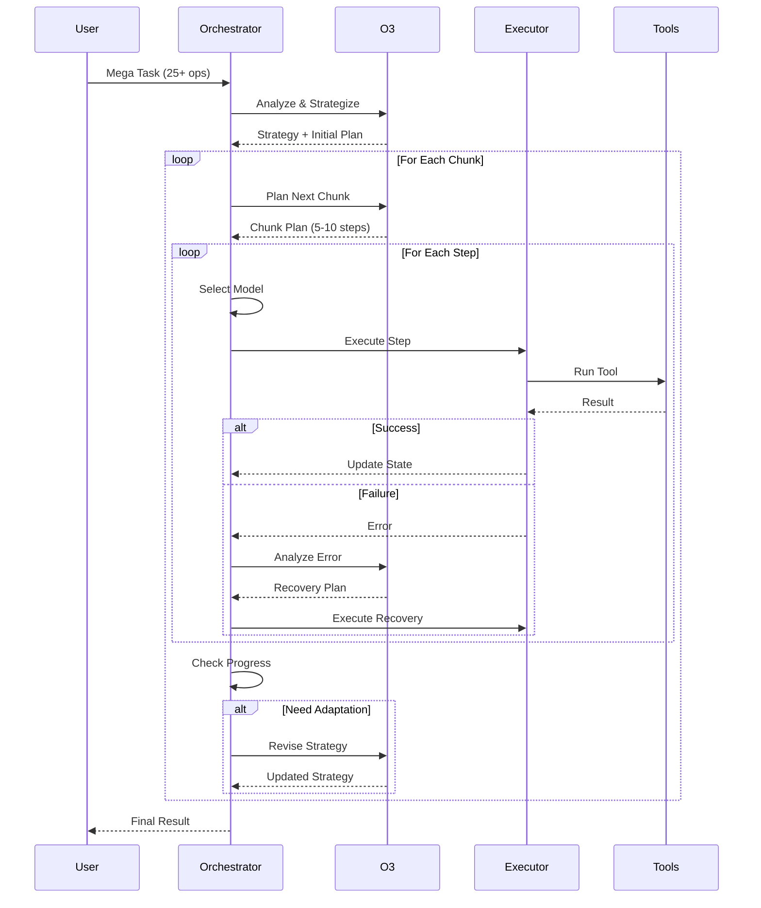

# OrionCLI Orchestration System Documentation

## Overview
OrionCLI uses an adaptive multi-model orchestration system that intelligently selects and coordinates different AI models based on task requirements, with continuous feedback loops and autonomous error recovery.

## System Architecture



## Adaptive Orchestration Flow



## Model Selection Matrix



## Error Recovery System



## Temperature Settings

| Model | Temperature | Use Case |
|-------|------------|----------|
| o3 | N/A | Does not support temperature |
| gpt-5 | 0.2 | Deterministic code generation |
| gpt-5-chat | 0.3 | Reliable tool execution |
| gpt-5-mini | 0.1 | Maximum consistency |
| gpt-4o | 0.3 | Balanced analysis |
| o4-mini | 0.0 | Pure determinism |

## Feedback Loop Mechanism



## Autonomy Features

### 1. **Smart Retry Mechanism**
- First retry: Same model with adjusted parameters
- Second retry: Upgraded model (e.g., gpt-5-mini → gpt-5-chat)
- Third retry: o3 analyzes and creates recovery plan

### 2. **Automatic Directory Creation**
```javascript
// If write_file fails due to missing directory
if (error.includes('directory not found')) {
  // Automatically create directory
  await execute('mkdir -p ' + dirname(filepath));
  // Retry file creation
}
```

### 3. **Tool Fallbacks**
```javascript
// Primary tool fails
write_file() fails
  ↓
// Fallback to bash
execute_bash('echo "content" > file')
  ↓
// If still fails, use alternative
execute_bash('cat > file << EOF\ncontent\nEOF')
```

### 4. **Progress Checkpoints**
- Every 5 steps for mega tasks
- After critical operations
- When error rate > 20%
- Before major state changes

## Mega Task Handling

### Detection Criteria
- Input contains 10+ numbered items
- Explicit count: "25 operations", "30 steps"
- Multiple sequencing words (then, after, next)
- Input length > 500 chars with creation tasks
- Keywords: "comprehensive", "complete", "everything"

### Execution Strategy
1. **o3 creates master strategy** (not detailed steps)
2. **Chunked execution** (5-10 steps per chunk)
3. **Parallel execution** where possible
4. **Continuous adaptation** based on results
5. **Smart recovery** from failures

## Success Metrics

| Metric | Target | Current |
|--------|--------|---------|
| Simple task success | 99% | ✅ |
| Multi-tool success (5-15) | 95% | ✅ |
| Mega task success (20+) | 90% | 🚧 |
| Error recovery rate | 95% | 🚧 |
| Parallel execution | 40% faster | 🚧 |

## Configuration

### Enable Adaptive Orchestration
```javascript
// Automatically enabled for mega tasks
// Manual override:
this.adaptiveOrchestrator.forceEnable = true;
```

### Debug Mode
```bash
DEBUG_TOOLS=1 node orion.js
```

### Model Override
```javascript
// Force specific model for testing
this.adaptiveOrchestrator.modelOverride = {
  'file_ops': 'gpt-5',  // Use gpt-5 for all file ops
  'planning': 'o3'      // Always use o3 for planning
};
```

## Implementation Files

1. **Core Orchestrator**: `/src/intelligence/adaptive-orchestrator.js`
   - Model selection logic
   - Chunked execution
   - Feedback loops
   - Error recovery

2. **Integration**: `/orion.js`
   - Lines 1107-1135: Mega task detection and orchestration
   - Lines 1664-1750: Tool execution with retry logic

3. **Tool Parser**: `/src/tools/json-tool-parser.js`
   - JSON extraction from AI responses
   - Multi-tool parsing
   - Error handling

## Testing

### Test Simple Task
```bash
node test-simple-debug.js
```

### Test Mega Task (25 operations)
```bash
node test-mega-enhanced.js
```

### Expected Results
- Simple tasks: < 2 seconds
- Multi-tool (5-10): < 10 seconds  
- Mega tasks (25+): < 60 seconds with 90%+ success

## Future Enhancements

1. **Parallel Execution Engine**
   - Execute independent steps simultaneously
   - Reduce total execution time by 40%

2. **Learning System**
   - Track successful patterns
   - Improve model selection over time

3. **Cost Optimization**
   - Track API costs per model
   - Optimize for cost vs speed tradeoff

4. **Visual Progress Dashboard**
   - Real-time progress visualization
   - Error tracking and recovery status

---

## Quick Reference

### When to Use Each Model
- **o3**: Planning, strategy, error analysis
- **gpt-5**: Code generation, complex algorithms
- **gpt-5-chat**: General execution, file ops, git
- **gpt-5-mini**: Simple reads, quick checks
- **gpt-4o**: Images, diagrams, visual content
- **o4-mini**: File exists, ultra-simple queries

### Common Issues & Solutions

| Issue | Solution |
|-------|----------|
| Tool not executing | Check JSON format, verify model selection |
| Slow execution | Use gpt-5-mini for simple tasks |
| High error rate | Enable debug mode, check recovery logs |
| Plan not adapting | Verify feedback loop is enabled |

---

**Last Updated**: 2024-01-09
**Version**: 1.0.0
**Status**: Active Development 🚧