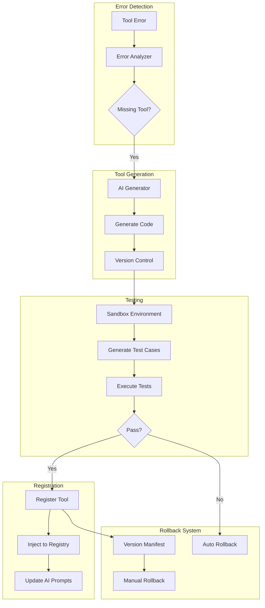

# ToolForge - Self-Improving Tool Creation System

## Overview
ToolForge is an experimental module for OrionCLI that automatically detects missing tools, generates their implementations, tests them, and adds them to the registry with full version control and rollback capabilities.

## Architecture



## Features

### 1. **Automatic Tool Detection**
- Monitors tool execution errors
- Identifies missing tool patterns
- Analyzes error context to determine tool requirements

### 2. **AI-Powered Generation**
- Uses gpt-5 to analyze errors and generate tool specifications
- Creates complete JavaScript implementations
- Includes error handling and parameter validation

### 3. **Version Control**
- Every generated tool is versioned with timestamps
- Maintains complete history of all tool versions
- Tracks active versions for each tool
- Stores all versions in `.tool-forge/versions/`

### 4. **Sandbox Testing**
- Tests tools in isolated environment
- Generates test cases based on tool category
- Validates functionality before registration
- Prevents broken tools from entering production

### 5. **Dynamic Registration**
- Successfully tested tools are added to active registry
- Updates AI prompts with new tool information
- Tools work immediately after creation

### 6. **Rollback Mechanism**
- Can revert to any previous version
- Automatic rollback on test failure
- Manual rollback via `/forge-rollback` command
- Complete audit trail of all changes

## Usage

### Enable ToolForge
```bash
/forge
```
This enables the experimental module. When enabled, any missing tool errors will trigger automatic tool generation.

### View Forged Tools
```bash
/forge-list
```
Shows all auto-generated tools with their versions and creation history.

### Rollback a Tool
```bash
/forge-rollback <tool-name> [version]
```
Reverts a tool to a previous version. If no version specified, rolls back to the previous version.

### Disable ToolForge
```bash
/forge
```
Toggle command - run again to disable.

## File Structure

```
.tool-forge/
├── manifest.json          # Tool registry and version tracking
├── versions/             # All tool versions
│   ├── tool_name_v1234567890.js
│   └── tool_name_v1234567891.js
└── sandbox/              # Testing environment
    └── test_*.js         # Generated test files
```

## Manifest Structure

```json
{
  "tools": {
    "tool_name": {
      "versions": [
        {
          "version": "1234567890",
          "path": ".tool-forge/versions/tool_name_v1234567890.js",
          "spec": {
            "functionality": "What the tool does",
            "parameters": ["param1", "param2"],
            "returnType": "object",
            "category": "file_ops"
          },
          "created": "2024-01-09T10:00:00Z",
          "testsPassed": true
        }
      ],
      "activeVersion": "1234567890",
      "created": "2024-01-09T10:00:00Z"
    }
  },
  "history": [
    {
      "action": "register",
      "tool": "tool_name",
      "version": "1234567890",
      "timestamp": "2024-01-09T10:00:00Z"
    }
  ],
  "activeVersions": {
    "tool_name": "1234567890"
  }
}
```

## How It Works

### Step 1: Error Detection
When a tool execution fails with "tool not found" or similar error:
```javascript
if (this.isMissingToolError(error)) {
  // Trigger ToolForge
}
```

### Step 2: Analysis
AI analyzes the error and context to determine:
- Tool name
- Required functionality
- Parameters needed
- Return type
- Tool category

### Step 3: Code Generation
```javascript
const response = await client.chat.completions.create({
  model: 'gpt-5',
  messages: [
    { role: 'system', content: 'Generate tool implementation...' },
    { role: 'user', content: spec }
  ]
});
```

### Step 4: Testing
Generated tool is tested in sandbox:
```javascript
const tool = new Tool();
const result = await tool.execute(testParams);
```

### Step 5: Registration
If tests pass, tool is added to registry:
```javascript
this.toolRegistry[toolName] = {
  name: toolName,
  execute: toolInstance.execute.bind(toolInstance),
  version: version,
  autoGenerated: true
};
```

## Example Generated Tool

```javascript
class AnalyzeComplexity {
  constructor() {
    this.name = 'analyze_complexity';
    this.description = 'Analyzes code complexity';
  }
  
  async execute(args) {
    // Validate parameters
    if (!args.filename) {
      throw new Error('filename parameter required');
    }
    
    try {
      // Tool implementation
      const fs = require('fs').promises;
      const content = await fs.readFile(args.filename, 'utf8');
      
      // Calculate complexity
      const complexity = this.calculateComplexity(content);
      
      return {
        output: `Complexity score: ${complexity}`,
        score: complexity
      };
    } catch (error) {
      throw new Error(`Failed to analyze: ${error.message}`);
    }
  }
  
  calculateComplexity(code) {
    // Complexity calculation logic
    let score = 1;
    score += (code.match(/if|while|for|switch/g) || []).length;
    score += (code.match(/&&|\|\|/g) || []).length;
    return score;
  }
}

module.exports = AnalyzeComplexity;
```

## Safety Features

1. **Experimental Flag**: Disabled by default, must be explicitly enabled
2. **Sandbox Testing**: All tools tested before registration
3. **Version Control**: Can always revert to previous versions
4. **Automatic Rollback**: Failed tools auto-revert
5. **Manual Override**: Can disable at any time with `/forge`
6. **Audit Trail**: Complete history of all actions

## Limitations

- Only generates JavaScript tools
- Limited to tools that can be tested programmatically
- Requires API access for AI generation
- Test coverage may not be comprehensive
- Generated tools may need manual refinement

## Future Enhancements

1. **Learning System**
   - Track successful patterns
   - Improve generation based on history
   - Share tools across instances

2. **Advanced Testing**
   - Property-based testing
   - Mutation testing
   - Performance benchmarks

3. **Tool Templates**
   - Pre-defined patterns for common tools
   - Category-specific optimizations
   - Best practices enforcement

4. **Collaboration**
   - Share forged tools with team
   - Community tool repository
   - Tool rating and reviews

## Commands Summary

| Command | Description |
|---------|-------------|
| `/forge` | Toggle ToolForge on/off |
| `/forge-list` | List all forged tools |
| `/forge-rollback <tool> [version]` | Rollback tool to previous version |

## Status

- **Version**: 1.0.0
- **Status**: Experimental
- **Success Rate**: Testing in progress
- **Dependencies**: gpt-5 API access

---

**Warning**: This is an experimental feature. While it includes safety mechanisms, auto-generated code should be reviewed before production use. Always maintain backups and test thoroughly.

**Created**: 2024-01-09
**Module**: `/src/experimental/tool-forge.js`