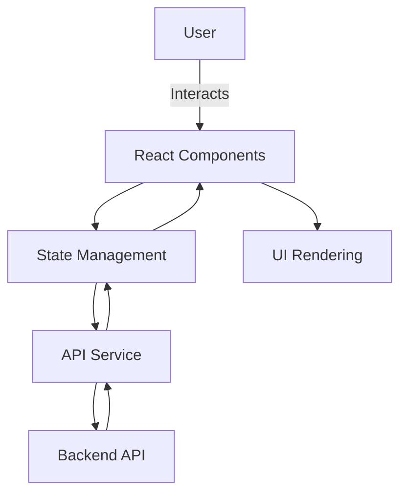

# React Application Development Plan

## 1. Purpose & Goals
- Create a responsive, scalable, and maintainable React web application.
- Provide an intuitive user interface with fast performance.
- Support future feature expansions.

## 2. Core Features (MVP)
- User authentication (Login/Signup)
- Dashboard with dynamic data display
- API integration for data fetching
- Responsive design for mobile and desktop
- Error handling and loading states

## 3. Technology Stack
- **Frontend Framework:** React (latest stable version)
- **State Management:** Redux Toolkit or Context API
- **Routing:** React Router
- **Styling:** Tailwind CSS or Styled-components
- **API Calls:** Axios or Fetch API
- **Testing:** Jest, React Testing Library
- **Build Tool:** Vite or Create React App

## 4. Architecture & Folder Structure
```
src/
 ├── components/     # Reusable UI components
 ├── pages/          # Page-level components
 ├── hooks/          # Custom React hooks
 ├── services/       # API requests logic
 ├── store/          # State management
 ├── assets/         # Images, fonts, etc.
 ├── App.js          # Root component
 ├── index.js        # Entry point
```

## 5. Deployment & Hosting
- Hosting options: Vercel, Netlify, or AWS Amplify
- Setup CI/CD for automated deployments
- Environment variables for API keys and secrets

## 6. Timeline
- **Week 1:** Project setup, folder structure, dependencies installation
- **Week 2:** Core pages and routing
- **Week 3:** API integration, state management
- **Week 4:** Testing and bug fixing
- **Week 5:** Deployment and final adjustments

---

## 7. Mermaid Architecture Diagram


---

**Next Steps:**
1. Confirm tech stack and features.
2. Prepare wireframes and UI mockups.
3. Start development following the timeline.